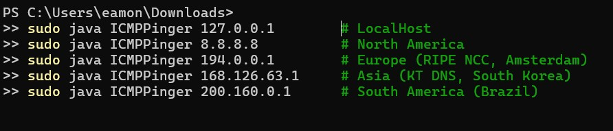
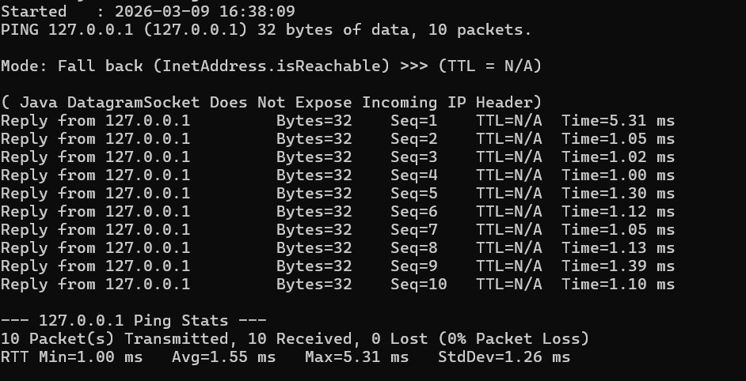
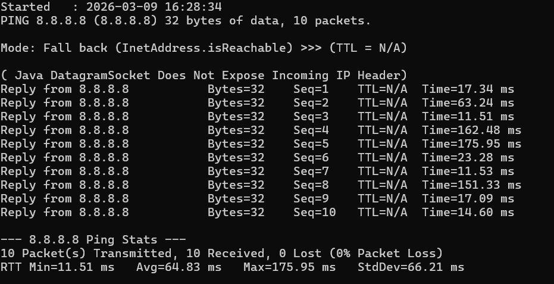
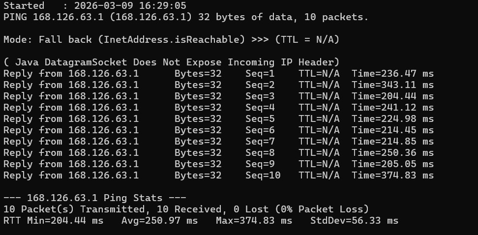
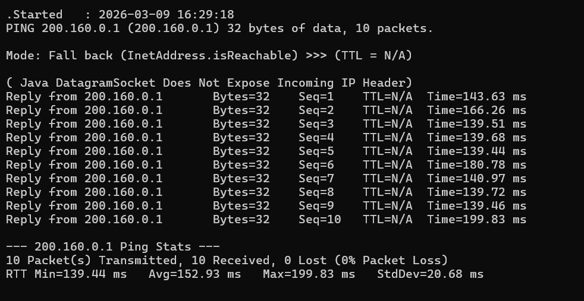
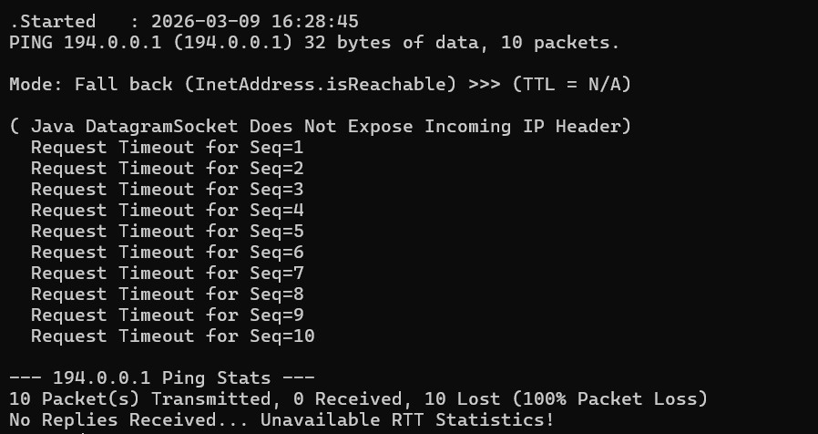

# ICMP Pinger - Java Implementation
### COSC 370 | Program 1 | Socket Programming

---

## Table of Contents
1. [Project Overview](#project-overview)
2. [Supported Platforms](#supported-platforms)
3. [Prerequisites](#prerequisites)
4. [How to Compile / How to Run](#how-to-compile--how-to-run)
5. [Sample Output 1 (Windows)](#sample-output-1-windows)
6. [Sample Output 2](#sample-output-2)
7. [Extra Credit](#extra-credit)
8. [Limitations](#limitations)
9. [References](#references)

---

## Project Overview
This program implements a Ping Application in Java using ICMP (Internet Control Message Protocol) echo request and reply messages. The pinger sends ICMP echo requests to a target host once per second and listens for ICMP echo replies. It measures the Round-Trip Time (RTT) for each packet and reports:

- Per-packet RTT (in milliseconds)
- TTL shown as `N/A` — Java's `DatagramSocket` does not expose the IP header, so TTL cannot be read
- Packet Loss Detection (timeout after 1 second)
- Summary Statistics: **Minimum, Maximum, and Average RTT**

  Our task is to develop our own Ping application. Our application will use ICMP but, in order
  to keep it simple, will not exactly follow the official specification in RFC 1739. We will only need to write the client side of the program.
---

## Supported Platforms

| Platform     | Supported | Notes                                                                                             |
|--------------|-----------|---------------------------------------------------------------------------------------------------|
| Linux        | Yes       | Recommended. Run with `sudo` for raw socket access.                                               |
| macOS        | Yes       | Run with `sudo`. Raw sockets require root on macOS.                                               |
| Win10/11     | Limited   | Raw socket support is restricted. Must run as Administrator. Results may vary by security policy. |

> **Important:** This program uses raw sockets, which require **Administrator or Root privileges** on all platforms. Without elevated permissions, the program automatically switches to fallback mode using `InetAddress.isReachable()`, which still measures RTT and packet loss but has reduced packet-level detail.

---

## Prerequisites

Before running the program, ensure the following are installed on your system:

| Requirement       | Minimum Version | How to Check     |
|-------------------|-----------------|------------------|
| Java JDK          | **JDK 9+**      | `java -version`  |
| javac (compiler)  | **JDK 9+**      | `javac -version` |

> **Note:** JDK 9 or higher is required. The program uses `ProcessHandle.current().pid()` which was introduced in Java 9. JDK 8 will not compile this program.

**To Install Java:**

- **Linux (Ubuntu/Debian):**
  ```bash
  sudo apt install default-jdk
  ```
- **macOS:** Download from [https://www.oracle.com/java/technologies/downloads/](https://www.oracle.com/java/technologies/downloads/) or use Homebrew:
  ```bash
  brew install openjdk
  ```
- **Windows:** Download and install the JDK from Oracle's website linked above.

---

## How to Compile / How to Run

Open a terminal (or Command Prompt on Windows) and navigate to the project directory.

### Step 1 — Navigate to the Source Folder

```bash
cd ICMPPinger
```

### Step 2 — Compile

```bash
javac ICMPPinger.java
```

This will generate `ICMPPinger.class` in the same directory.

---

### How to Run / Test Program

#### Linux / macOS Terminal

```bash
sudo java ICMPPinger <hostname or IP>
```

Example:

```bash
sudo java ICMPPinger google.com
```

```bash
sudo java ICMPPinger 127.0.0.1
```

#### Windows Command Prompt (run as Administrator)

```bash
java ICMPPinger <hostname or IP>
```

Example:

```bash
java ICMPPinger google.com
```

```bash
java ICMPPinger 127.0.0.1
```

#### Eclipse IDE

1. Import the project: **File → Import → Existing Projects into Workspace**
2. Right-click `ICMPPinger.java` → **Run As → Run Configurations**
3. Under **Arguments**, enter the target hostname or IP (e.g., `127.0.0.1`)
4. On Linux/macOS, Eclipse must be launched with `sudo` for raw socket access

---

---

### Commands Used


---

### Test 1 — Localhost (127.0.0.1) — Loopback Test


> RTT Min=1.00 ms  Avg=1.55 ms  Max=5.31 ms  StdDev=1.26 ms — 0% Packet Loss

---

### Test 2 — North America (8.8.8.8 — Google DNS, USA)


> RTT Min=11.51 ms  Avg=64.83 ms  Max=175.95 ms  StdDev=66.21 ms — 0% Packet Loss

---

### Test 3 — Asia (168.126.63.1 — KT DNS, South Korea)


> RTT Min=204.44 ms  Avg=250.97 ms  Max=374.83 ms  StdDev=56.33 ms — 0% Packet Loss

---

### Test 4 — South America (200.160.0.1 — NIC Brazil)


> RTT Min=139.44 ms  Avg=152.93 ms  Max=199.83 ms  StdDev=20.68 ms — 0% Packet Loss

---

### Test 5 — Europe (194.0.0.1 — RIPE NCC, Amsterdam) — Packet Loss Demo


> 10 Lost (100% Packet Loss) — Demonstrates timeout detection. Host did not respond,
> confirming the program correctly handles unreachable targets and reports full packet loss.

---

## Hiearchy Chart


## Pseudocode

The main program reads the target host and packet count from the command line arguments, resolves the hostname to an IP address, prints a startup message with a timestamp, then tests whether raw socket access is available. Raw Ping (runRawPing) manually builds and sends ICMP Echo Request packets and listens for replies. It gets the current process ID to tag each packet so it can identify its own replies. For each ping it records the send time, sends the packet, then waits up to 1 second for a reply and retries up to 5 times if unrelated packets arrive. Fallback Ping (runFallbackPing) is used when raw socket access is unavailable, which happens on Windows without administrator privileges. Instead of manually building ICMP packets, it uses Java's built-in isReachable() method which handles the ping internally through the operating system. Build ICMP Echo Request (buildICMPEchoRequest) constructs the raw bytes of an ICMP Echo Request packet from scratch. It allocates a 40 byte buffer and fills in the ICMP header fields and after building the packet it computes the checksum and inserts it into the correct position in the header. Compute Checksum (ComputeCheckSum) works by treating the packet as a sequence of 16-bit words and summing them all together. If there is a leftover byte at the end it adds it as the high byte of a 16-bit word. Parse ICMP Reply (ICMPReply) takes the raw bytes received from the socket and extracts the ICMP fields from them. Describe Destination Unreachable (describeDestUnreach) translates ICMP error code numbers into human readable messages. Print Summary (printSum) prints the final statistics after all pings have been sent and calculates how many packets were lost and the loss percentage. Check Raw Socket (canUseRawSocket) tests whether the program has permission to use raw ICMP sockets before committing to either mode by sending a probe ICMP packet to a host and waiting up to 500 milliseconds for a reply. Sleep One Second (sleepOneSec) is a simple helper method that pauses execution for 1 second between each ping. Print Usage (printUsage) is a helper method that prints instructions to the console when the user runs the program without providing the required host argument. 

## Extra Credit

This implementation parses ICMP error response codes and displays human-readable error messages to the user.

**Supported ICMP error types:**

| ICMP Type | Code | Description                               |
|-----------|------|-------------------------------------------|
| 3         | 0    | Destination Network Unreachable           |
| 3         | 1    | Destination Host Unreachable              |
| 3         | 2    | Destination Protocol Unreachable          |
| 3         | 3    | Destination Port Unreachable              |
| 3         | 9    | Network Administratively Prohibited       |
| 3         | 13   | Communication Administratively Prohibited |
| 11        | 0    | Time Exceeded (TTL expired in transit)    |

---

## Limitations

**Java API**
- Java's `DatagramSocket` does not expose the incoming IP header, so **TTL is not available**
  and is always shown as `N/A`. A native solution (JNI or a C helper) would be required to read TTL.
- There is no native raw ICMP socket class in Java — the program relies on `DatagramSocket`,
  which sends UDP rather than true raw ICMP.
- `InetAddress.isReachable()` uses TCP echo on Windows instead of ICMP, so fallback mode
  is not truly ICMP-based on Windows.

**Platform**
- On WSL (Windows Subsystem for Linux), raw socket access is blocked at the OS level
  regardless of `sudo`, the program will always run in fallback mode on WSL.
- On Windows, raw ICMP sockets behave differently due to OS-level restrictions and may
  not produce consistent results even when running as Administrator.
- Raw socket mode requires `sudo` on Linux and macOS — the program cannot run in raw
  mode without elevated privileges.
- Raw socket access is blocked or restricted in some managed network environments
  (e.g., university firewalls). If pings to external hosts fail, try a different network.

**Extra Credit**
- ICMP error code parsing (Type 3, Type 11) only runs in Raw ICMP mode — error codes
  will never be displayed in fallback mode.
- Most modern routers and firewalls silently drop packets to unreachable addresses rather
  than sending back a Type 3 Destination Unreachable response, making these errors
  difficult to trigger in practice.

**Protocol**
- IPv4 only — IPv6 (ICMPv6) is not supported.
- Requires **JDK 9 or higher**, will not compile on JDK 8 due to use of `ProcessHandle`.
- The program sends one ping per second and waits up to 1 second for a reply before
  marking a packet as lost. Neither the interval nor the timeout is configurable via
  command line.

**Network**
- Packet loss and timeout behavior depends on the network path and intermediate routers,
  not the program itself.
- Some hosts (e.g., `194.0.0.1` RIPE NCC, Europe) may not respond to ICMP requests,
  resulting in 100% packet loss regardless of network connectivity.

---


## References
- Internet Control Message Protocol (RFC 792): https://datatracker.ietf.org/doc/html/rfc792
- Computing the Internet Checksum (RFC 1071): https://datatracker.ietf.org/doc/html/rfc1071
- Java `InetAddress` API Documentation: https://docs.oracle.com/javase/8/docs/api/java/net/InetAddress.html
- Java `DatagramSocket` API Documentation: https://docs.oracle.com/javase/8/docs/api/java/net/DatagramSocket.html
